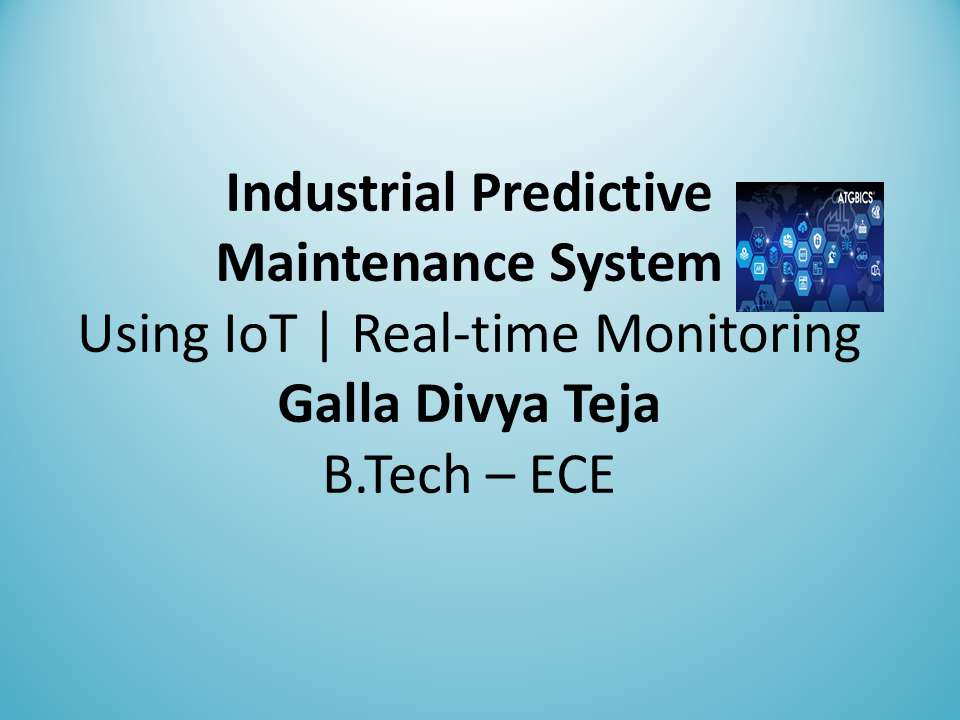
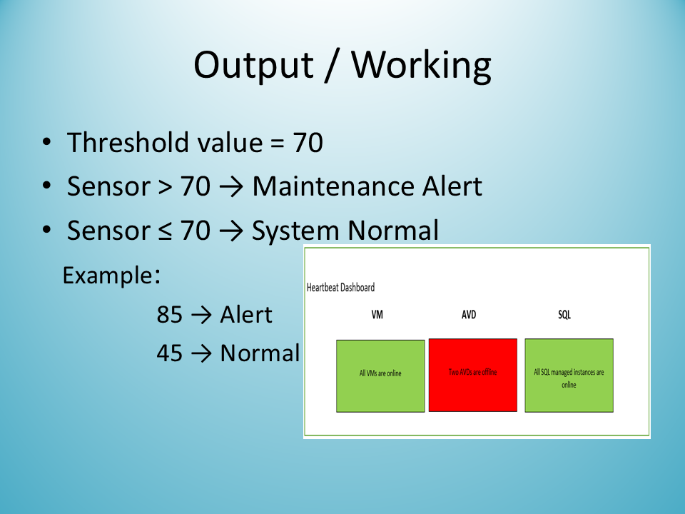

<h1 align="center">🤖 AI-Powered Predictive Maintenance System</h1>
<h3 align="center">📊 Real-Time Dashboard for Machine Failure Prediction</h3>

---

## 📌 Overview

This project is an **end-to-end predictive maintenance system** that analyzes machine sensor data to estimate the probability of failure in real time.

It combines:

* 🧠 Machine Learning for prediction
* ⚙️ FastAPI backend for processing
* 🌐 React dashboard for visualization

👉 The goal is to **reduce downtime and prevent equipment failures**.

---

## 🚀 Key Features

* 🔮 **Failure Prediction Model** (Scikit-learn)
* ⚡ **FastAPI Backend** for real-time API processing
* 📊 **Interactive React Dashboard**
* 🗄️ **SQLite Database** for logging predictions
* 🚨 **Alert System** (Normal / Warning / Critical)
* 📈 Real-time sensor input simulation

---

## 🧩 System Architecture

```id="arch1"
Sensor Data → FastAPI Backend → ML Model → Database → React Dashboard
```

---

## 🛠️ Tech Stack

| Layer            | Technology      |
| ---------------- | --------------- |
| Backend          | Python, FastAPI |
| Frontend         | React (Vite)    |
| Machine Learning | Scikit-learn    |
| Database         | SQLite          |
| Data Processing  | Pandas          |

---

## 📂 Project Structure

```id="arch2"
ai-predictive-maintenance-dashboard/
├── backend/      → API + ML model
├── frontend/     → React dashboard
├── docs/         → Project report & PPT
├── images/       → Screenshots
├── README.md
```

---

## 📸 Screenshots

### 🖥️ Dashboard



### 📊 Prediction Result



---

## ▶️ How to Run

### 🔧 Backend Setup

```id="run1"
cd backend
pip install -r requirements.txt
python model/train_model.py
uvicorn app.main:app --reload
```

👉 API runs at:
http://127.0.0.1:8000

---

### 🌐 Frontend Setup

```id="run2"
cd frontend
npm install
npm run dev
```

👉 Dashboard runs at:
http://localhost:5173

---

## 📊 Sample Output

```id="run3"
Status: Critical
Failure Probability: 85%
Message: Maintenance Required
```

---

## 💡 Real-World Applications

* 🏭 Manufacturing industries
* ⚡ Power plants
* 🚆 Transportation systems
* 🏢 Smart factories

---

## 🚀 Future Enhancements

* 🤖 Advanced ML / Deep Learning models
* ☁️ Cloud deployment (AWS / Azure)
* 📧 Email & SMS alerts
* 📈 Real-time charts (live graphs)
* 🔐 Authentication system

---

## 👨‍💻 Author

**Galla Divya Teja**
💡 Aspiring Software Engineer | AI & IoT Enthusiast

---

## ⭐ Support

If you found this project useful, consider giving it a ⭐ on GitHub

---
